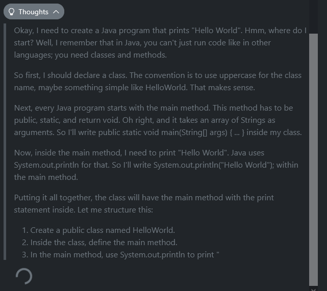
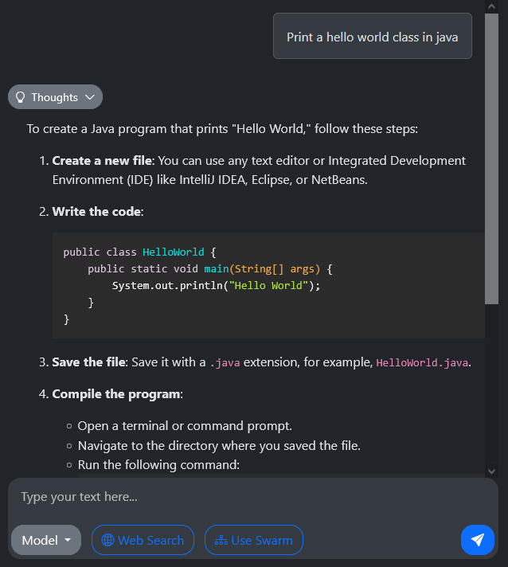

# Spring AI Sandbox
This project is a sandbox to create different proof of concept implementations about ideas or things I want to try with 
large language models.

## Roadmap

The idea is to build separate proof of concepts and use cases, and slowly consolidate some common tooling around it.

Also, I would like to make progressively more advanced proof of concepts up to reaching the point of having a swarm of
specialised AI agents (goal of my hive4j project, but I started that before spring-ai existed).

I've got to a point where I have realised the use cases and proof of concepts I'm making just won't work with the local
models I can run with ollama in my hardware. So I can wait for optimisations, or start paying openai and/or deepseek
apis.

### Phase 1: My chat

I want to create a reusable UI that replicates the typical AI chat assistant user experience. For that I can still make
use of free local models. However, I would like to keep an option to switch between the best local reasoner model I can
run, and the 3rd party API models (deepseek/openai). There might be queries I want to keep for myself, and queries I
don't mind other services taking note.

### Phase 2: Web search and scraping

For that one I have realised local models are not good enough (as of early 2025 yet). So I need to start using APIs.
Maybe some of the simpler tasks can be done locally by smaller models, and then only use openai when is needed.
I need to build the tooling in a way that depending on the use case, it uses live openai APIs, or asynchronous batch.

### Phase 3: Agents

For my agents memory I plan to use local pgvector, I need to make the tooling flexible so that they run live when
being asked from a chat, and run in async batch mode when instanciated under a swarm.

### Deepseek vs. OpenAI vs. Local

Both companies are bad options in the sense that they keep and use your data for training. Best case scenario good 
enough models get small enough to run locally or affordable enough to run in leased GPU clusters per hour.

But for now, and as I'm still developing the proof of concept, I'll be using their APIs.

Here are the pros and cons for Deepseek and OpenAI:

Deepseek:
- Pro: Has no rate limit, just responses taking longer to answer.
- Pro: comparable to openai's o1, while cheaper.
- Con: Context limit might be too small for my use cases.

OpenAI:
- Pro: Longer context length (200k)
- Pro: o3-mini is slightly better than r1
- Pro: async batch mode could be a nice way to run the swarm in the future with no rate limits
- Pro: Has multi-modal models (I guess good for web scraping?)
- Pro: Tools support
- Con: 10x more expensive than deepseek

I think I can start with deepseek and then eventually move to OpenAI when I see a better model, vision, or batching is
needed?

## Setup
In order to run the examples, you will need ollama installed locally with a model downloaded,
and change the `application.properties` with your own preferences as explained in [their docs](https://docs.spring.io/spring-ai/reference/api/chat/ollama-chat.html).

Alternatively, if you want to use your OpenAI/Azure/Mistral/Anthropic subscriptions, you will need
to add the dependency in the pom and tweak the `application.properties`. You can find information
about how to do that in the [Chat Models](https://docs.spring.io/spring-ai/reference/api/chatmodel.html) documentation.

Once you have this setup done, you can proceed to run the different examples.

# Proof of concepts / use cases

## Chat

### Description

It aims to be a barebones local replacement of ChatGPT.

### Status

Basic functionality is there, and it is usable, but it still needs some polish.

We are using a system prompt that allows the LLM to "think" with its own chain of thought in a hidden tag,
and provide the final answer separately.



The output is formatted as markdown and the code is highlighted.



_(Sadly, llama 3.1 still does not know how to use spring-ai)_

### Running Instructions

Run the main application and head to [http://localhost:8080](http://localhost:8080).

## Helgar

### Description

My third attempt to replicate the famous [Generative Agents: Interactive Simulacra of Human Behavior](https://arxiv.org/pdf/2304.03442) paper. 

First time trying to do it with LLM function calling. This time I decided to start small with a single NPC character, Helgar, a hunter in the woods.

### Status

Looks promising, but the function calling with llama 3.2 is still unreliable, so I parked it for now.
Also, DeepSeek-r1 does not have function calling, so still parked.

### Running Instructions

Run the main application and observe what Helgar decides to do after waking up.

## Live Translate

### Description

I wondered if an LLM could be used to translate the chat of an international online video game.

### Status

Done. The proof of concept worked fine, If I want to continue I should start the proper project on its own repo.

Example output:

```json
[
  {"id": "001", "speaker": "PlayerA", "content": "¡Hola, alguien puede ayudarme con esta misión?", "language": "Spanish", "translation": ""},
  {"id": "002", "speaker": "PlayerB", "content": "Sure, what do you need?", "language": "English", "translation": "", "original": "Sure, what do you need?"}, 
  {"id": "003", "speaker": "PlayerC", "content": "Привет! Я могу помочь, где ты?", "language": "Russian", "translation": "Hello! I can help, where are you?"},
  {"id": "004", "speaker": "PlayerA", "content": "Estoy en el puente del río.", "language": "Spanish", "translation": "", "original": "I'm on the river bridge."},
  {"id": "005", "speaker": "PlayerD", "content": "Πού είσαι; Χρειάζεσαι βοήθεια;", "language": "Greek", "translation": "Where are you? Do you need help?"}, 
  {"id": "006", "speaker": "PlayerB", "content": "I think they’re at the river bridge.", "language": "English", "translation": "", "original": "I think they're at the river bridge."},
  {"id": "007", "speaker": "PlayerA", "content": "Exacto, estoy ahí. Gracias por venir.", "language": "Spanish", "translation": "", "original": "Exactly, I'm here. Thanks for coming."}, 
  {"id": "008", "speaker": "PlayerC", "content": "Я уже иду. Подожди немного!", "language": "Russian", "translation": "I'm already going. Wait a little bit!"}, 
  {"id": "009", "speaker": "PlayerD", "content": "Καταλαβαίνω, ερχομαι κι εγώ!", "language": "Greek", "translation": "I understand, I'll come too!"},
  {"id": "010", "speaker": "PlayerB", "content": "Got it. Let’s all meet there.", "language": "English", "translation": "", "original": "Got it. Let's all meet there."},
  {"id": "011", "speaker": "PlayerA", "content": "Gracias a todos, realmente lo aprecio.", "language": "Spanish", "translation": "", "original": "Thanks to everyone, I really appreciate it."}, 
  {"id": "012", "speaker": "PlayerC", "content": "Всегда рад помочь!", "language": "Russian", "translation": "Always glad to help!"}, 
  {"id": "013", "speaker": "PlayerD", "content": "Είναι πάντα χαρά μου να βοηθάω.", "language": "Greek", "translation": "It's always my pleasure to help."}
]
```

### Running Instructions

Run the main application and observe the console output.

## Mira

### Description

Magic Inglish Real Academy. An attempt at making a translator from spanish/english to our own flavour of spanglish: "Magic English".

### Status

Looks like LLMs (or at least the biggest models I have been able to run locally - llama 3.2 8B q8 / deepseek-r1:14b) are not good enough yet to get an idea of what Magic English is and make satisfactory translations.

Example:
```text
>>> Please translate the following text into Magic English:

Anoche, mi abuela se puso a bailar flamenco en la cocina mientras mi perro ladraba al ritmo. Al final, el gato terminó sobre la mesa con un sombrero de papel de aluminio como si fuera el rey de la casa. ¡Fue un espectáculo digno de una película!

================================
Result: Anonche my abuelita started to flamencobate in the kichen whil my dog was barking at the ritmo. At the end, the gato ended up on the mesa with a papel hat like he was the king of the casa! It was a espectaculo worthy of a moviefilm, entonches!
================================
```

As we can see, the model I'm able to run is not doing a very good job.

### Running Instructions

Run the main application and observe the console output.

## Mixtenser

### Description

I once had a colleague who was very good at mixing sayings together and making up new ones. So I wanted to try see if LLMs can do the same.

### Status

Done. Seems like LLMs are amazing at doing that. In the example I even tried a chain of thought to make the LLM generate a few variations and self-evaluate to select the best.

Example:

```text
>>> Give me a saying or an idiom in english
Bite off more than you can chew.

>>> Please create ten twisted variations of the following saying or idiom, one in each line: Bite off more than you can chew.
You'll choke on a salad with an Instagrammable garnish.
Biting into a Google search results page is not your best bet.
Trying to eat a whole pizza by yourself is like trying to hug a skyscraper.
Chewing on too many buzzwords will give you lockjaw.
Ate more than you could peck at the pixelated buffet of life.
Taking a bite out of a Netflix show with 100 seasons is like eating a whole encyclopedia.
Trying to eat your weight in avocado toast will make you feel crumby.
Biting off more sushi rolls than you can roll back up will leave you feeling shell-shocked.
Chewing on too many clicksbait headlines will clog your scroll.
Eating a plate of reality TV drama is like trying to swallow a whole mountain range.

>>> Please rate the following twisted sayings and pick the best:
[ ... ]

**Variation 1: You'll choke on a salad with an Instagrammable garnish.**

* Absurdity/Sarcasm (8/10): A clever play on the typical "you'll choke" phrase, using it in a context that's both relatable and absurd.
* Humor (7/10): While amusing, this variation might not be laugh-out-loud funny for everyone.
* Creativity (9/10): The use of Instagrammable garnish is a fresh and unexpected twist on the original phrase.
* Clarity/Brevity (8/10): Easy to understand, but slightly long-winded.

Weighted score: 7.6

**Variation 2: Biting into a Google search results page is not your best bet.**

* Absurdity/Sarcasm (9/10): A hilarious and unexpected take on the original phrase, using the concept of Google search results in a literal sense.
* Humor (8/10): This variation has a great comedic value, making it hard to imagine someone not laughing.
* Creativity (7/10): While creative, this twist is somewhat less unique than others on this list.
* Clarity/Brevity (9/10): Easy to understand and concise.

Weighted score: 8.3

**Variation 3: Trying to eat a whole pizza by yourself is like trying to hug a skyscraper.**

* Absurdity/Sarcasm (6/10): A decent play on words, but less absurd than other variations.
* Humor (8/10): Amusing, but not as laugh-out-loud funny as some others.
* Creativity (5/10): The comparison to hugging a skyscraper is somewhat generic and expected.
* Clarity/Brevity (9/10): Easy to understand, but slightly wordy.

Weighted score: 7.0

**Variation 4: Chewing on too many buzzwords will give you lockjaw.**

* Absurdity/Sarcasm (8/10): A clever play on words that's both absurd and funny.
* Humor (6/10): Not as universally laugh-out-loud funny as some others, but still amusing.
* Creativity (7/10): The use of lockjaw is a fresh twist on the original phrase.
* Clarity/Brevity (8/10): Easy to understand.

Weighted score: 7.1

**Variation 5: Ate more than you could peck at the pixelated buffet of life.**

* Absurdity/Sarcasm (4/10): While attempting to be creative, this variation comes across as forced and less absurd.
* Humor (6/10): Not particularly funny or clever.
* Creativity (3/10): The use of "peck at" is awkward and unconvincing.
* Clarity/Brevity (7/10): Somewhat confusing and wordy.

Weighted score: 5.0

**Variation 6: Taking a bite out of a Netflix show with 100 seasons is like eating a whole encyclopedia.**

* Absurdity/Sarcasm (8/10): A funny and unexpected comparison that works well.
* Humor (7/10): Amusing, but not as laugh-out-loud funny as some others.
* Creativity (6/10): The use of an encyclopedia is somewhat generic, but the context is fresh.
* Clarity/Brevity (8/10): Easy to understand.

Weighted score: 7.4

**Variation 7: Trying to eat your weight in avocado toast will make you feel crumby.**

* Absurdity/Sarcasm (5/10): A decent play on words, but less absurd than others.
* Humor (8/10): Amusing and clever, making it easy to imagine someone laughing at this.
* Creativity (4/10): The comparison is somewhat generic and expected.
* Clarity/Brevity (9/10): Easy to understand.

Weighted score: 7.2

**Variation 8: Biting off more sushi rolls than you can roll back up will leave you feeling shell-shocked.**

* Absurdity/Sarcasm (9/10): A hilarious and unexpected take on the original phrase, using a literal interpretation of "rolling back up."
* Humor (9/10): Laugh-out-loud funny, making it hard to imagine someone not enjoying this.
* Creativity (8/10): The use of sushi rolls is fresh and unique in this context.
* Clarity/Brevity (8/10): Easy to understand.

Weighted score: 8.6

**Variation 9: Chewing on too many clickbait headlines will clog your scroll.**

* Absurdity/Sarcasm (7/10): A clever play on words that's both absurd and funny.
* Humor (5/10): Not as universally laugh-out-loud funny as some others, but still amusing.
* Creativity (6/10): The use of "clog your scroll" is a fresh twist on the original phrase.
* Clarity/Brevity (8/10): Easy to understand.

Weighted score: 6.7

**Variation 10: Eating a plate of reality TV drama is like trying to swallow a whole mountain range.**

* Absurdity/Sarcasm (5/10): A decent play on words, but less absurd than others.
* Humor (7/10): Amusing and clever, making it easy to imagine someone laughing at this.
* Creativity (4/10): The comparison is somewhat generic and expected.
* Clarity/Brevity (9/10): Easy to understand.

Weighted score: 6.8

**Ranking**

1. **Biting off more sushi rolls than you can roll back up will leave you feeling shell-shocked.** (8.6)
2. **Chewing on too many buzzwords will give you lockjaw.** (7.1)
3. **You'll choke on a salad with an Instagrammable garnish.** (7.6)
4. **Trying to eat your weight in avocado toast will make you feel crumby.** (7.2)
5. **Taking a bite out of a Netflix show with 100 seasons is like eating a whole encyclopedia.** (7.4)

**<winner>Biting off more sushi rolls than you can roll back up will leave you feeling shell-shocked.</winner>**

This variation stands out for its exceptional combination of absurdity, humor, and creativity. The use of "roll back up" in a literal sense is both unexpected and hilarious. The comparison to being "shell-shocked" adds an extra layer of cleverness, making this variation the top-ranked choice.
================================
Result: Biting off more sushi rolls than you can roll back up will leave you feeling shell-shocked.
================================
```

With this example we can see how the chain of thought works, by self-evaluating ten variations and choosing the best.

### Running Instructions

Run the main application and observe the console output until it gives you a new saying.

## Pathfinder

### Description

After reading the books of the Bobiverse series, I was inspired to make a narrative web game where the LLM would serve as a "game master", and the player could chat to trigger actions and drive its own story.

### Status

After doing the first chapter and testing it a few times, I realised that despite the concept seems cool, it also gets old and boring really quickly. Need to rethink, maybe adding other aspects or using a different setting might help to keep it interesting.

### Running Instructions

Run the main application and head to [http://localhost:8080](http://localhost:8080).

## ByteCoda

### Description

With Deepseek-r1 14B, I thought we could build a system that processes a java code base and vectorises it to answer questions with RAG.

### Status

The TPOC is complete but the results are not satisfactory. The model may have been provided with sufficient context to answer the questions, but hallucinates the rest or reaches the maximum context length.

### Running Instructions

For running the application, you will need to set up a postgresql pgvector server and tweak the properties to point to it. Once you have that, run the main application, wait until the vector store is rebuilt, and ask questions in the console (stdin).

## Web Search

### Description

With Deepseek-r1 14B, I dared to develop a proof of concept for web search. The idea is to perform web search and scraping to provide the LLM with the context to answer correctly.

### Status

So far, results are mixed. It works well when the model can answer your question from the description of the web pages in the search results. Example: `What are camagrocs?`. 

However, it will go off the rails if it has to try to navigate a web page to gather more specific data. Example: `give me a list of user kettoleon's projects on github`.

On the other hand, I tried copy-pasting the requests to [deepseek chat](https://chat.deepseek.com), and looks like if I paid the API or ran the full model on a cluster, results would be good.

### Running Instructions

For running the application, you will first need to provide an environment property `brave.token` in `application.properties` with the token from [brave search api](https://brave.com/search/api/).
After that, run the `SearchApplication.java` class and once the spring context is loaded, use stdin to ask a question.